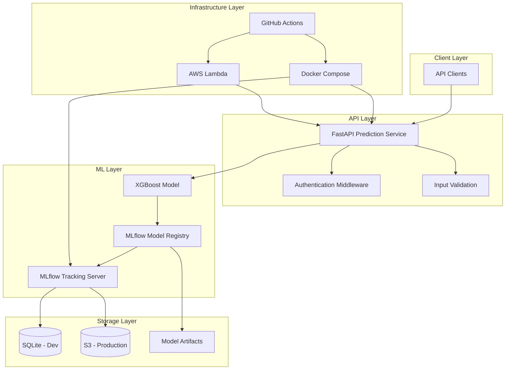

# ML API Platform Design Document

## Overview

The ML API Platform is a containerized machine learning system that provides classification predictions through a FastAPI service, with complete ML lifecycle management via MLflow. The platform supports both local development with Docker Compose and production deployment on AWS Lambda using container images.

The system follows a microservices architecture with clear separation between the prediction service, ML tracking components, and deployment infrastructure. All components are containerized for consistency across environments and integrated through a Git-based CI/CD pipeline.

## Architecture

### High-Level Architecture



### Component Architecture

The system consists of three main service components:

1. **Prediction Service**: FastAPI application serving the /predict endpoint
2. **MLflow Tracking Server**: Experiment tracking and model registry management
3. **Training Pipeline**: Model training and hyperparameter optimization workflow

## Components and Interfaces

### 1. FastAPI Prediction Service

**Purpose**: Serves classification predictions via REST API with comprehensive authentication, validation, and monitoring using a modular architecture

**Modular Architecture Structure**:
```
app/
├── main.py                  # Entry point with FastAPI app and router registration
├── api/
│   └── routes/              # API route modules with APIRouter
│       ├── predictions.py   # Prediction endpoints
│       ├── health.py        # Health check endpoints  
│       ├── models.py        # Model information endpoints
│       └── __init__.py
├── schemas/                 # Pydantic models for input/output validation
│   ├── prediction.py        # Prediction request/response schemas
│   ├── health.py           # Health check schemas
│   ├── error.py            # Error response schemas
│   └── __init__.py
├── models/                  # Database/ORM models (future SQLAlchemy integration)
│   ├── user.py             # User model for future authentication
│   ├── prediction_log.py   # Prediction logging model
│   └── __init__.py
├── services/                # Business logic layer
│   ├── prediction_service.py # Prediction business logic
│   ├── model_service.py     # Model loading and management
│   ├── auth_service.py      # Authentication logic
│   └── __init__.py
├── core/                    # Core configurations and setup
│   ├── config.py           # Application configuration
│   ├── database.py         # Database setup (future)
│   ├── security.py         # Security and authentication setup
│   └── __init__.py
└── utils/                   # Helper functions and utilities
    ├── logging.py          # Logging utilities
    ├── metrics.py          # Metrics collection
    └── __init__.py
```

**Key Components**:
- `PredictionRouter`: APIRouter for prediction endpoints with proper tagging
- `HealthRouter`: APIRouter for health check endpoints
- `ModelRouter`: APIRouter for model information endpoints
- `PredictionService`: Business logic for model loading and inference
- `AuthService`: Authentication and authorization logic
- `ConfigManager`: Centralized configuration management
- `LoggingUtils`: Structured logging and monitoring utilities

**Design Rationale**: The modular architecture separates concerns clearly (Requirement 12.1), uses APIRouter for organized routing (Requirement 12.2), and enables better maintainability and testing. Each module has a single responsibility, making the codebase more scalable and easier to understand.

**Interfaces**:
```python
# API Endpoint
POST /predict
Content-Type: application/json
Authorization: Bearer <api-key>

# Request Schema
{
    "data": [
        {"feature1": value1, "feature2": value2, ...},
        {"feature1": value3, "feature2": value4, ...}
    ]
}

# Response Schema
{
    "predictions": [0, 1, 0],
    "model_version": "1.2.3",
    "timestamp": "2024-01-01T12:00:00Z"
}

# Health Check Endpoints
GET /health/ready
GET /health/live

# Auto-generated Documentation
GET /docs (Swagger UI)
GET /redoc (ReDoc)
```

### 2. MLflow System

**Purpose**: Manages complete ML lifecycle including experiment tracking, model registry, hyperparameter optimization, and multi-environment artifact storage

**Key Components**:
- `TrackingServer`: MLflow tracking server with SQLite backend for development
- `ModelRegistry`: Versioned model storage with stage management (staging/production)
- `ArtifactStore`: Environment-specific storage (SQLite for dev, S3 for production)
- `ExperimentLogger`: Automatic logging of training metrics, parameters, and artifacts
- `HyperparameterOptimizer`: Integrated automated parameter tuning system
- `ModelPromotion`: Workflow for promoting models between stages

**Design Rationale**: The dual storage approach (SQLite for development, S3 for production) provides cost-effective local development while ensuring production scalability (Requirements 2.4, 2.5). Integrated hyperparameter optimization reduces the complexity of model tuning workflows (Requirement 2.6).

**Interfaces**:
- MLflow REST API for model registry operations
- Python MLflow client for training integration
- Artifact storage interface (SQLite/S3)
- Model stage management API
- Hyperparameter optimization interface

### 3. Training Pipeline

**Purpose**: Trains reproducible XGBoost classification models on public tabular datasets with automated hyperparameter optimization

**Key Components**:
- `DataLoader`: Loads and preprocesses public tabular datasets with validation
- `PreprocessingPipeline`: Handles missing values, categorical encoding, and feature scaling
- `ModelTrainer`: XGBoost training with MLflow autologging and reproducible seeds
- `HyperparameterOptimizer`: Automated parameter tuning with experiment tracking
- `ModelEvaluator`: Performance evaluation with comprehensive metrics
- `ModelRegistrar`: Automatic model registration to MLflow registry with metadata

**Design Rationale**: The pipeline emphasizes reproducibility through fixed random seeds and comprehensive preprocessing (Requirements 5.4, 5.6). Integration with MLflow autologging ensures all experiments are tracked without manual intervention (Requirement 5.2).

**Interfaces**:
- Configuration-driven training parameters with environment overrides
- MLflow autologging integration for metrics and artifacts
- Model artifact output to registry with versioning
- Hyperparameter optimization results tracking

### 4. Container Infrastructure

**Purpose**: Provides consistent, secure deployment across development and production environments with comprehensive health monitoring

**Key Components**:
- `Dockerfile.api`: FastAPI service container with health checks and security hardening
- `Dockerfile.mlflow`: MLflow server container with artifact storage configuration
- `docker-compose.yml`: Local development orchestration with service networking
- `lambda-container`: AWS Lambda deployment package with optimized startup time
- `HealthCheckSystem`: Container-level readiness and liveness probes
- `SecurityConfiguration`: HTTPS enforcement, CORS restrictions, and IAM integration

**Design Rationale**: Multi-stage Docker builds reduce production image size while maintaining development convenience (Requirement 3.5). Health checks enable proper container orchestration and monitoring (Requirements 3.6, 10.4). Security configurations enforce HTTPS and implement least-privilege access (Requirements 9.2, 9.4).

## Data Models

### Input Data Schema
```python
class PredictionRequest(BaseModel):
    data: List[Dict[str, Union[str, int, float]]]
    
class FeatureRow(BaseModel):
    # Dynamic schema based on training data
    # Example for a sample dataset:
    feature_1: float
    feature_2: int
    feature_3: str
    # ... additional features
```

### Model Metadata Schema
```python
class ModelMetadata(BaseModel):
    model_name: str
    version: str
    stage: str  # "staging", "production"
    algorithm: str  # "xgboost"
    metrics: Dict[str, float]
    created_at: datetime
    tags: Dict[str, str]
```

### Configuration Schema
```python
class APIConfig(BaseModel):
    host: str = "0.0.0.0"
    port: int = 8000
    model_name: str
    model_stage: str = "production"
    api_key: str  # API key for authentication
    log_level: str = "INFO"
    cors_origins: List[str] = []  # Whitelisted domains for CORS
    https_only: bool = True  # Enforce HTTPS in production

class MLflowConfig(BaseModel):
    tracking_uri: str
    artifact_root: str
    backend_store_uri: str
    default_artifact_root: str
    s3_bucket: Optional[str] = None  # S3 bucket for production artifacts
    aws_region: str = "us-east-1"

class SecurityConfig(BaseModel):
    secrets_manager_enabled: bool = False
    parameter_store_enabled: bool = False
    iam_role_arn: Optional[str] = None
    
class MonitoringConfig(BaseModel):
    cloudwatch_enabled: bool = False
    sns_topic_arn: Optional[str] = None
    pagerduty_integration_key: Optional[str] = None
    log_retention_days: int = 30
```

## Error Handling

### Centralized Error Handling Strategy
The system implements a comprehensive error handling approach with predictable responses, automatic recovery mechanisms, and detailed logging for troubleshooting (Requirements 10.1, 6.5).

### API Error Responses
- **400 Bad Request**: Invalid input data format, missing required fields, or data validation failures
- **401 Unauthorized**: Invalid or missing API key authentication
- **403 Forbidden**: CORS policy violations or insufficient permissions
- **404 Not Found**: Model not found in registry or endpoint not available
- **422 Unprocessable Entity**: Data validation errors with detailed field-level feedback
- **429 Too Many Requests**: Rate limiting exceeded (production environment)
- **500 Internal Server Error**: Model loading, prediction errors, or system failures

### Error Response Schema
```python
class ErrorResponse(BaseModel):
    error: str
    message: str
    timestamp: datetime
    request_id: str
    details: Optional[Dict[str, Any]] = None  # Additional context for debugging
```

### MLflow Error Handling
- **Model Loading Failures**: Automatic fallback to previous stable model version
- **Artifact Storage Issues**: Retry logic with exponential backoff for S3 connectivity
- **Experiment Tracking Failures**: Local fallback with batch synchronization
- **Registry Synchronization**: Conflict resolution with version precedence rules
- **Training Pipeline Errors**: Automatic experiment cleanup and notification

### Container and Infrastructure Error Handling
- **Health Check Failures**: Graceful degradation with service isolation
- **Lambda Cold Starts**: Optimized container initialization and connection pooling
- **Resource Exhaustion**: Memory and CPU monitoring with automatic scaling triggers
- **Network Failures**: Circuit breaker patterns for external service calls
- **Deployment Failures**: Automatic rollback with health check validation

### Security Error Handling
- **Input Sanitization**: Protection against injection attacks with detailed logging
- **Authentication Failures**: Rate limiting and suspicious activity detection
- **CORS Violations**: Detailed logging of unauthorized cross-origin requests

## Testing Strategy

### Comprehensive Testing Framework
The testing strategy ensures 80% minimum test coverage with automated execution in CI/CD pipeline (Requirements 8.1, 8.2, 8.3).

### Unit Testing
- **API Layer**: FastAPI endpoint testing with pytest and httpx, including error scenarios
- **Model Layer**: XGBoost model prediction accuracy and performance testing
- **MLflow Integration**: Tracking, registry operations, and hyperparameter optimization testing
- **Validation Layer**: Input schema validation with edge cases and malformed data
- **Authentication**: API key validation and security middleware testing
- **Configuration**: Environment-specific settings validation and override testing

### Integration Testing
- **End-to-End API**: Full request/response cycle with real model predictions
- **MLflow Workflow**: Complete training to prediction pipeline integration
- **Container Integration**: Docker Compose multi-service interaction testing
- **Authentication Flow**: API key validation and CORS policy testing
- **Database Integration**: SQLite and S3 artifact storage testing
- **CI/CD Integration**: Build, test, and deployment pipeline validation

### Performance Testing
- **API Load Testing**: Concurrent request handling with realistic traffic patterns
- **Model Inference Speed**: Prediction latency benchmarking under various loads
- **Container Startup Time**: Lambda cold start optimization and memory usage
- **Resource Consumption**: CPU, memory, and storage utilization monitoring
- **Scalability Testing**: Performance degradation analysis under increasing load

### Security Testing
- **Authentication Testing**: API key validation, rate limiting, and brute force protection
- **Input Validation**: Injection attack prevention and data sanitization
- **CORS Policy Testing**: Cross-origin request validation and whitelist enforcement
- **Container Security**: Image vulnerability scanning and runtime security

### Environment Testing
- **Development Environment**: Docker Compose functionality and service networking
- **Production Simulation**: AWS Lambda container deployment and integration testing
- **CI/CD Pipeline**: Automated build, test, and deployment workflow validation
- **Configuration Management**: Environment variable overrides and secrets management
- **Monitoring Integration**: CloudWatch metrics, SNS alerts, and logging validation

### Test Data and Fixtures
- **Mock Services**: External dependency mocking for isolated testing
- **Test Datasets**: Synthetic tabular data for training and prediction testing
- **Model Fixtures**: Pre-trained models for consistent testing scenarios
- **Configuration Fixtures**: Environment-specific test configurations

## Deployment Architecture

### Development Environment
Docker Compose orchestration providing complete local development stack:
- **FastAPI Application Container**: Prediction service with hot-reload capabilities
- **MLflow Tracking Server Container**: Experiment tracking with SQLite backend
- **Shared Volume Management**: Persistent storage for models and artifacts
- **Service Networking**: Internal communication between containers
- **Health Check Integration**: Container readiness and liveness monitoring
- **Development Tools**: Debugging, logging, and development utilities

**Design Rationale**: Local SQLite storage reduces development complexity while Docker Compose provides production-like service orchestration (Requirements 7.2, 3.3).

### Production Environment
AWS Lambda-based serverless deployment with enterprise-grade features:
- **Container Image Packaging**: Optimized Lambda-compatible containers
- **S3 Artifact Storage**: Scalable model and experiment artifact storage
- **CloudWatch Integration**: Comprehensive logging and custom metrics
- **API Gateway Integration**: Request routing, throttling, and authentication
- **IAM Security**: Least-privilege access control and role-based permissions
- **SNS/PagerDuty Alerting**: Critical incident notification system
- **Secrets Management**: AWS Secrets Manager and Parameter Store integration

**Design Rationale**: Lambda provides automatic scaling and cost optimization while S3 ensures artifact durability and availability (Requirements 2.5, 9.4, 6.6, 6.7).

### CI/CD Pipeline
GitHub Actions workflow with comprehensive automation and quality gates:

**Build Stage**:
- Code quality checks (linting, formatting, static typing)
- Security vulnerability scanning
- Dependency analysis and license compliance

**Test Stage**:
- Unit test execution with coverage reporting
- Integration test suite with real service interactions
- Performance benchmarking and regression detection
- Security testing and penetration analysis

**Deploy Stage**:
- Container image building with multi-stage optimization
- Image registry push with vulnerability scanning
- Development environment deployment and validation
- Production deployment with approval gates and rollback capabilities

**Monitoring Stage**:
- Deployment health validation
- Performance metrics collection
- Error rate monitoring and alerting
- Rollback automation on failure detection

**Design Rationale**: Automated quality gates ensure reliable releases while approval processes maintain production stability (Requirements 4.1, 4.2, 4.5, 4.6).

## Security Architecture

### Authentication and Authorization
- **API Key Authentication**: Simple, secure token-based access control for API endpoints
- **CORS Policy Enforcement**: Whitelist-based cross-origin request validation
- **HTTPS Enforcement**: TLS encryption for all production communications
- **Input Sanitization**: Comprehensive data validation and injection attack prevention

### Infrastructure Security
- **IAM Role Management**: Least-privilege access principles for AWS resources
- **Secrets Management**: AWS Secrets Manager and Parameter Store for credential storage
- **Container Security**: Image vulnerability scanning and runtime security monitoring
- **Network Security**: VPC isolation and security group restrictions in production

**Design Rationale**: API key authentication provides simplicity while maintaining security for ML API use cases. HTTPS enforcement and CORS restrictions protect against common web vulnerabilities (Requirements 9.1, 9.2, 9.3, 9.5).

## Monitoring and Observability

### Logging Strategy
- **Structured Logging**: JSON-formatted logs with consistent schema across services
- **Request Tracing**: Unique request IDs for end-to-end request tracking
- **Performance Metrics**: Latency, throughput, and error rate monitoring
- **Security Logging**: Authentication failures, suspicious activity, and access patterns

### Monitoring Infrastructure
- **CloudWatch Metrics**: Custom metrics for API performance and model accuracy
- **Health Check Endpoints**: Kubernetes-style readiness and liveness probes
- **Alerting System**: SNS and PagerDuty integration for critical incidents
- **Dashboard Integration**: Real-time monitoring and historical trend analysis

### Error Tracking and Recovery
- **Centralized Error Handling**: Consistent error responses with detailed context
- **Automatic Recovery**: Retry logic, circuit breakers, and graceful degradation
- **Rollback Capabilities**: Automated deployment rollback on health check failures
- **Incident Response**: Automated alerting and escalation procedures

**Design Rationale**: Comprehensive observability enables proactive issue detection and rapid incident response, critical for production ML systems (Requirements 6.1, 6.2, 6.3, 6.4, 6.5, 6.6, 6.7, 10.2, 10.3, 10.4, 10.5).

## Documentation and API Design

### Auto-Generated Documentation
- **OpenAPI Specification**: Automatic generation from FastAPI application code
- **Interactive Documentation**: Swagger UI and ReDoc interfaces for API exploration
- **Schema Validation**: Request/response schema documentation with examples
- **Authentication Documentation**: Clear API key usage instructions and examples

### Developer Experience
- **Example Payloads**: Complete request/response examples for /predict endpoint
- **Setup Instructions**: Comprehensive README with environment configuration
- **Troubleshooting Guide**: Common issues and resolution procedures
- **API Versioning**: Clear versioning strategy for backward compatibility

**Design Rationale**: Auto-generated documentation ensures accuracy and reduces maintenance overhead while providing excellent developer experience (Requirements 11.1, 11.2, 11.3, 11.4, 11.5).